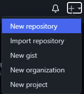
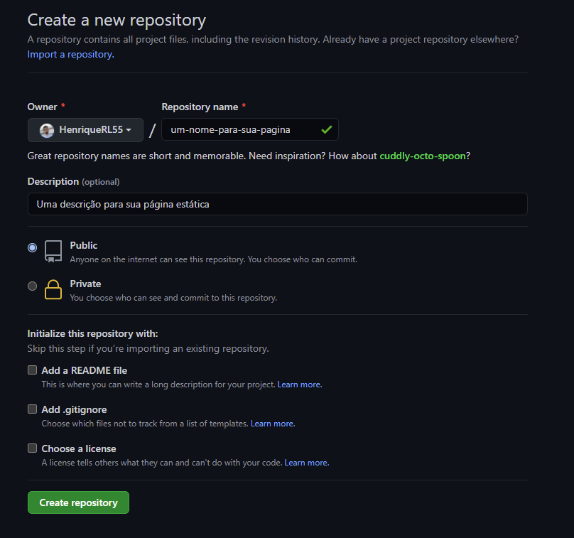
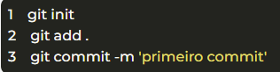
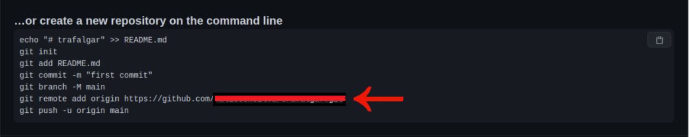
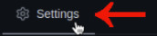
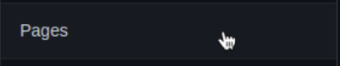
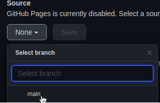
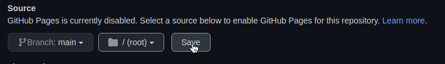
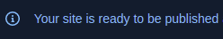
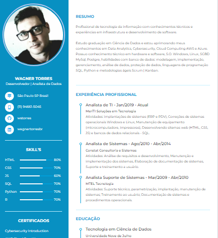

#### PROJETO PRÁTICO | CURRICULO WEB<!--Obrigatorio-->

[)](https://github.com/wstorres) 

<strong>About me: </strong> 
Wagner Torres | 12 Out 2022 

 

<!--Título do Projeto-->
<h2 align="center">Deploy com GitHub Pages</h1>

<!--

  

   
  
  
  
  
  
  
  

-->

  <a href="#-about-the-project">Sobre o projeto</a>&nbsp;&nbsp;&nbsp;|&nbsp;&nbsp;&nbsp;
  <a href="#-technologies">Tecnologias</a>&nbsp;&nbsp;&nbsp;|&nbsp;&nbsp;&nbsp;
  <a href="#-requisitos">Requisitos</a>&nbsp;&nbsp;&nbsp;|&nbsp;&nbsp;&nbsp;
  <a href="#-projeto">Iniciando o projeto</a>&nbsp;&nbsp;&nbsp;|&nbsp;&nbsp;&nbsp;
  <a href="#-how-to-contribute">Como contribuir</a>&nbsp;&nbsp;&nbsp;|&nbsp;&nbsp;&nbsp;
  <a href="#-license">Licença</a>

 

## Sobre o Projeto

 Projeto prático desenvolvido no curso de Git e GitHbub realizado na "Digital Innovation One" - DIO com o objetivo de praticar os conhecimentos adquiridos no treinamento e demonstrar o uso da ferramenta para criação do portfólio de projetos: Criando Seu Currículo Online Usando a ferramentas do GitHub Pages.

## Tecnologias

- [HTML5](#)
- [CSS3](#)
- [GIT](#)
- [Github Pages](#)

<!--

- [Node.js](https://nodejs.org/)
- [ReactJS](https://reactjs.org/)
- [React Native](https://reactnative.dev/)
- [TypeScript](https://www.typescriptlang.org/)
- [TypeORM](https://typeorm.io/#/)
- [Express](https://expressjs.com/pt-br/)
- [React Router DOM](https://reacttraining.com/react-router/)
- [React Navigation](https://reactnavigation.org/)
- [React Icons](https://react-icons.netlify.com/#/)
- [Styled Components](https://styled-components.com/)
- [Axios](https://github.com/axios/axios)
- [Eslint](https://eslint.org/)
- [Prettier](https://prettier.io/)
- [EditorConfig](https://editorconfig.org/)
- [Lazy Loading](https://pt.wikipedia.org/wiki/Lazy_loading)
- [Code Splitting](https://pt-br.reactjs.org/docs/code-splitting.html)

-->

## Requisitos

- [Vscode](#)
- [GIT](#) 
  
## Projeto

#### Passo 1. Preparando o Ambiente:

É necessário que seja instalado o Git em sua máquina, sendo ele o responsável por subir o nosso repositório.

- [Link de download do GIT](https://git-scm.com/downloads)

#### Passo 2. Criando um repositório no GitHub:

Acesso a pagina do github no Link Abaixo e acesso sua conta:
  
- [Link do site Github](https://github.com)

- Ao acessar sua conta, no canto superior direito terá a opção de um ícone com um “+”, ao interagir com ele, clique em “New Repository”
   

 

 - Clicando no botão “Create repository” no fim da página, você será direcionado para a página de seu novo repositório.
   
 

  

#### Passo 3. Enviado a aplicação para o repositório:

**Agora, utilizado o Git, abra a pasta do projeto com o Git, para isto então, (no Windows)**

- Clique com o botão direito na pasta de seu projeto e clique na opção “Git Bash Here”, sendo um usuário Linux ou Mac, é necessário acessar a pasta pelo terminal do sistema.
   
- Com o terminal ou o Git Bash aberto, é necessário inicializar um novo repositório local com o comando “git init”.
  
- Após isso execute o comando “git add” e por fim adicione todos os arquivos ao seu repositório com o comando “git commit -m ‘primeiro commit’.

  

#### Passo 4. Criar um link entre seu repositório local:

- Agora devemos criar um link entre seu repositório local e o que criamos no GitHub, para isso, digite o penúltimo comando que aparece no primeiro box do repositório que você criou.

 
  

- Por fim, você pode digitar o último comando, ou seja, “git push -u origin main”. Neste último passo será necessário preencher suas credenciais do Github, sendo e-mail e senha.
   

#### Passo 5. Colocando a página online:

**Para finalizar, solicite que o Github disponibilize um link para sua página.**

- Vá no seu repositório e vá em configurações.

 

  

- Vá em “pages”.

 

  

- Vá para em “source” e selecione a branch main no dropdown e clique em save.

  

- Salve as configurações.
  

 

#### Passo 6. Link de acesso a pagina:

Aguarde alguns segundos e o GitHub irá disponibilizar um link para sua página, pronto, sua página estática está online!

 

  

#### Projeto Finalizado e Publicado!

 - Link do Projeto: [Curriculo Web](https://wstorres.github.io/curriculo-designer/)
- Imagem do Projeto: [Curriculo web](./img/deploy10.png)
  

 

## Para contribuir

> ##### Faça um fork para este repositório seguindo os passos abaixo:
.
> ##### Clone seu fork  
        $ git clone your-fork-url && cd curriculo-designer
.

> ##### Criar branch com sua feature >

        $ git checkout -b my-feature

.

> ##### Faça um commit com suas alterações:

        $ git commit -m 'feat: My new feature'
.

> ##### Envie seu código para o repo remoto:

      $ git push origin my-feature
.
> ##### Depois que seu pull request for mesclado (merged), você poderá excluir sua branch.

    $ git merge my-feature

 

## 📝 Licença

This project is licensed under the MIT License - see the LICENSE file for details.

---

Desenvolvido por 💜 Wagner Torres 👋 Veja meu linkedin

