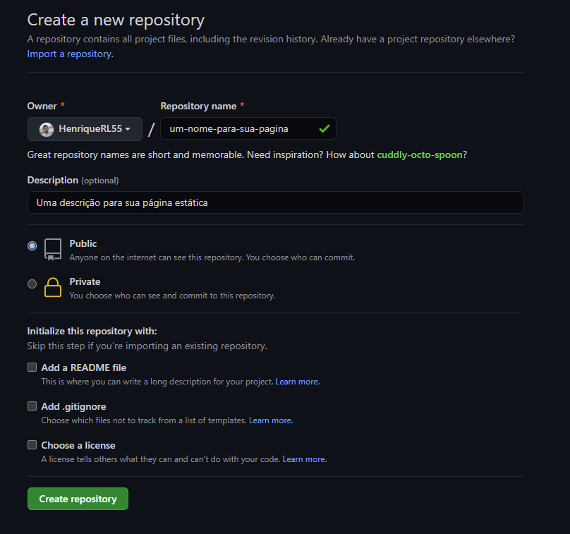
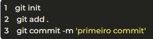
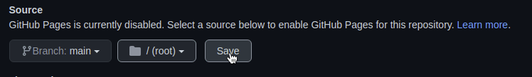

#### PROJETO PRÁTICO | DEPLOY<!--Obrigatorio-->

[CURRICULO](#) | [HTML](#) | [CSS](#) | 
Por:<strong> Wagner Torres</strong> | Data: 05/10/2022
  
 
 

<h1 align="center">Deploy com GitHub Pages</h1>

### Passo 1. Preparando o Ambiente
É necessário que seja instalado o Git em sua máquina, sendo ele o responsável por subir o nosso repositório.

[Link de download](https://git-scm.com/downloads)

### Passo 2. Criando um repositório no GitHub

  1. Ao acessar sua conta, no canto superior direito terá a opção de um ícone com um “+”, ao interagir com ele, clique em “New Repository”
   
   

  2. Clicando no botão “Create repository” no fim da página, você será direcionado para a página de seu novo repositório.
   
 

### Passo 3. Enviado a aplicação para o repositório

Agora será utilizado o Git, precisamos abrir a pasta de nosso projeto com o Git, para isto então, se você é um usuário Windows, 

1. clique com o botão direito na pasta de seu projeto e clique na opção “Git Bash Here”, sendo um usuário Linux ou Mac, é necessário acessar a pasta pelo terminal do sistema.
2. Com o terminal ou o Git Bash aberto, é necessário inicializar um novo repositório local com o comando “git init”, 
3. após isso execute o comando “git add” e por fim adicione todos os arquivos ao seu repositório com o comando “git commit -m ‘primeiro commit’.

 

### Passo 4. Criar um link entre seu repositório local

1. Agora devemos criar um link entre seu repositório local e o que criamos no GitHub, para isso, digite o penúltimo comando que aparece no primeiro box do repositório que você criou

 

2. Por fim, você pode digitar o último comando, ou seja, “git push -u origin main”. Neste último passo será necessário preencher suas credenciais do Github, sendo e-mail e senha.
   

### Passo 5. Colocando a página online:

Para finalizar, solicite que o Github disponibilize um link para sua página, 

1. Vá no seu repositório e vá em configurações.

 

1. Vá em “pages”

 

1. vá para em “source” e selecione a branch main no dropdown e clique em save.

 

1.  Salve as configurações

  

### Passo 6. Link de acesso a pagina

Aguarde alguns segundos e o GitHub irá disponibilizar um link para sua página, pronto, sua página estática está online!

 

### Projeto Finalizado e Publicado!

 - Link do Projeto: [Curriculo Web](https://wstorres.github.io/curriculo-designer/)

